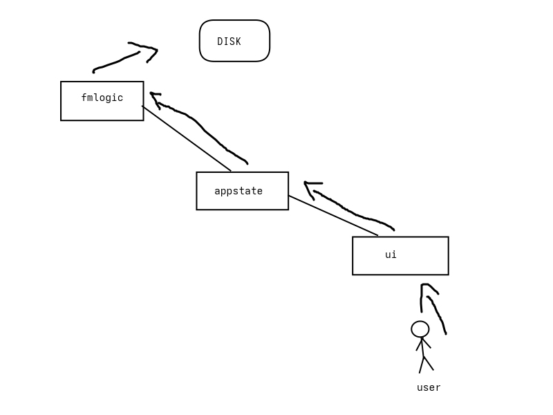

# FileMan

graphical file manager written in nim. lightweight. no electron. no bloat.

---

## what it is

a native gui file explorer built with nim and nigui.  
opens folders. moves files. gets out of your way.

---

## stack

- **nim** — compiled, fast, no runtime
- **nigui** — native gui toolkit, not a browser wrapper

---

## install

```sh
git clone https://github.com/Voctl/FileMan
cd FileMan
nimble install nigui
nim compile -d:release fileman.nimble
./fileman
```

---

## structure

```
FileMan/
├── src/
├── fileman.nimble
├── ui
├── appstructure.jpg
└── LICENSE
```

---

## why not electron

because a file manager doesn't need a javascript runtime.  
nigui talks directly to the os. that's it.

---

## license

MIT.

## screenshot


